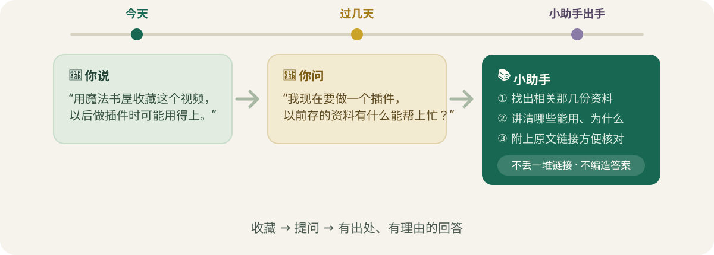
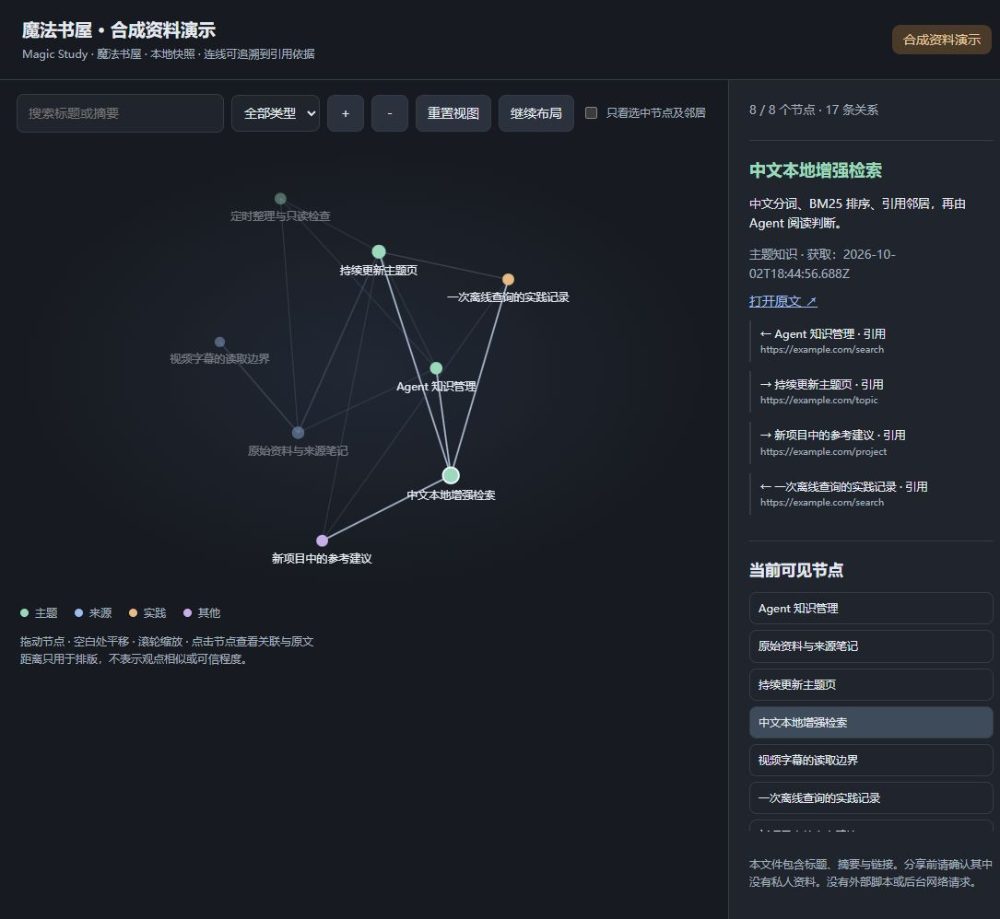
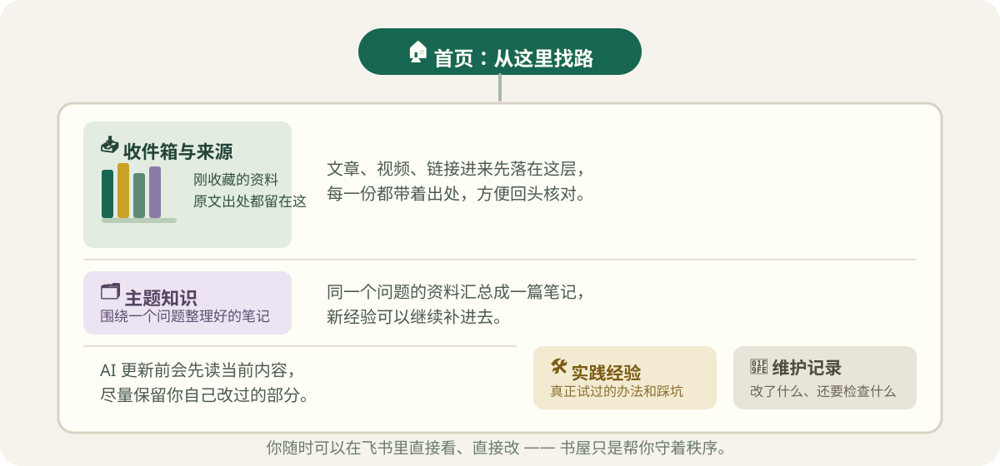

<div align="center">


简称 **elx-ms** · 正式 Skill 名称 **`elx-magic-study`** · 当前版本 **[0.7.0](https://github.com/Ee1ex/elx-magic-study/releases/tag/v0.7.0)**

[怎么用](#-平时这样说就行) · [开始使用](#-第一次怎么用) · [看看图谱](#-还能画一张知识地图) · [开发说明](docs/DEVELOPMENT.md)

</div>

你是不是也存了很多文章和视频，过几天就忘了放在哪？

魔法书屋像一个住在飞书里的小书屋。你把资料交给 AI 小助手，它帮你记重点、分书架、留下出处。以后遇到问题，再帮你把有用的内容找出来。

**它是一份教 AI 怎么工作的“小手册”（Skill），需要配合能使用 Skill 的 AI 工具。**

## 🪄 看一个小例子



> **今天的你：**“用魔法书屋收藏这个视频。以后做插件时可能用得上。”
>
> **过几天的你：**“我现在要做一个插件。以前存的资料，有什么能帮上忙？”
>
> **小助手应该做：** 找资料、读内容，告诉你哪些能用、为什么能用，再附上原文链接。

它不会只丢给你一堆链接，也不应该把没找到的答案编出来。

## 🗺️ 还能画一张知识地图

说一句：**“用魔法书屋给我看看知识图谱。”**

就能生成一个在浏览器里打开的 HTML 文件。点一点、拖一拖，看看一篇笔记和哪些资料有关。



*这是用合成资料生成的真实功能演示，不是任何人的私人知识库。*

支持搜索、类型筛选、放大缩小、拖动和只看某篇笔记的邻居。点开笔记，还能看一句简短说明；没有说明时，就显示一小段正文。笔记变了，旧说明就不会再当成新内容。线来自已有引用，不代表 AI 已经证明两个观点都正确。

## 🌱 小书屋怎么工作


1. **放进来**：给它文章、视频链接、文档，或自己的想法。
2. **整理好**：记下重点和出处，把有关的内容放在一起。
3. **随时问**：带着你的问题，让它找资料、讲理由。

读完新资料，小助手会先看看已有书架，建议放到一个主要位置，贴上少量标签，再连到有关的旧主题。跨几个主题的资料也只存一份主笔记，不到处复制。你可以在保存前说“换个书架”或“去掉这个标签”。

以后有了新经验，还能补进旧笔记，就像给一本常看的书添上自己的小纸条。已经整理好的笔记，不会再被当成新资料反复整理；修改旧资料或批量搬家仍会先给你看清单。

## 💬 平时这样说就行

| 你想做什么 | 你可以这样说 |
|---|---|
| 先存一下 | “用魔法书屋先收藏这个，备注是……” |
| 看懂资料 | “整理这篇文章，重点看方法和限制。” |
| 看懂视频 | “总结这个视频，保留关键时间点。” |
| 比较几份材料 | “把这三份一起整理，看看哪里相同、哪里不同。” |
| 帮当前项目 | “结合我现在的需求，找以前的相关经验。” |
| 留下经验 | “把这次踩坑的原因和解决办法补进去。” |
| 看知识地图 | “生成一份可以点击的知识图谱。” |
| 检查书架 | “看看有没有重复、过期或互相矛盾的内容，先别修改。” |
| 自动分书架 | “整理这份资料，自动分类、加标签，先给我看入库预览。” |
| 配置读取工具 | “帮我检查能不能读B站或小红书；缺什么先告诉我，安装前问我。” |
| 安排定时整理 | “每周一早上九点检查新资料，上海时区，先生成草稿。” |
| 给新书架换图标 | “这次新建的分类，如果你能操作飞书界面，先推荐图标给我确认。” |

也可以明确调用：

```text
用 $elx-magic-study 帮我整理这份资料。
```

`elx-ms` 是简称，不是需要额外安装的另一个 Skill。

## 🚪 第一次怎么用

你需要：**一个飞书账号、能使用 Skill 的 AI 工具，以及 Node.js 22 或更高版本。** 飞书连接使用官方 `lark-cli`。


### 1. 把小手册交给 AI

你可以从 [最新发布页](https://github.com/Ee1ex/elx-magic-study/releases/latest) 下载 Skill ZIP，解压后把完整的 `elx-magic-study` 文件夹交给你的 AI。不要只复制其中一份文件。

如果下载的是整个仓库，在仓库目录运行：

```bash
node scripts/install.mjs --apply
```

它会把 Skill 放进个人 Codex Skills 目录。已有同名、不同内容的版本时会停下来，不直接覆盖。

如果你不熟悉命令，把这句话交给你的 AI：

```text
请帮我安装这个仓库里的 elx-magic-study Skill。
先检查已有安装，不要覆盖我改过的文件。
```

其他支持 Skill 的工具，可导入完整的 `skills/elx-magic-study` 文件夹。不同工具的安装位置可能不同；目前主要在 Windows 与 Codex 中验证。

### 2. 让它带你连接飞书

在能识别新 Skill 的对话里说：

```text
用 $elx-magic-study 帮我连接飞书知识库。
```

0.5.0 新增首次导览：小助手先简短介绍能做什么、哪些功能可选、初始化需要你配合什么；以后只在合适场景提醒，并尊重“暂不使用”或“不再提醒”。

小助手会检查连接，带你选知识库和保存位置。需要飞书授权时，会给你链接和二维码，由你亲自在飞书确认。0.6.0增加专用知识库引导：已有绑定直接复用；没有目标时先查找，确认后新建独立的「魔法书屋知识库」及首页。第一次使用还会主动问：“要不要开启定时整理？”你可以先不开启，照常使用。

遇到读不了的文章、视频或评论，它会先检查现有工具。0.6.0优先引导缺少 OpenCLI 的用户下载 [OpenCLIApp 桌面版](https://opencli.info/download)：在软件内点击“安装／修复 CLI”，再到“功能 → OpenCLI Skills → 安装到 Claude／Agents…”安装配套指引，具体位置以当前界面为准。

[OpenCLI](https://github.com/jackwener/OpenCLI) 配置还需要检查浏览器、扩展连接和当前 Agent 能否识别 Skills；由你本人登录平台，再实际试读目标内容。CLI 显示“已安装”不等于评论已经能读取。其他读取需求可按需选择 [Agent Reach](https://github.com/Panniantong/Agent-Reach)，不强制先安装它。暂不配置也可以先存链接，或直接提供正文。

**不要把密码、密钥或 Token 发到聊天里。** 已有可用授权时会优先复用；缺少工具或权限时，会解释需要什么，不自动扩大权限。

### 3. 放进第一份资料

```text
用魔法书屋整理这篇文章。
告诉我它能解决什么问题，准备存到哪里。
```

默认先看增改预览，你确认后再保存。0.7.0 新增精细标题「具体内容概括丨末级分类」：概括优先约8字、最多10字符，保留品牌和对象，例如「OPPO耳机耳帽选购丨数码与音频」，原始标题留正文。新建首页会先写知识库介绍和用途，再用三步流程表、11项功能提示词表说明用法；实际写入并回读后才报告完成。0.6.0会在第一次入库时按内容建立必要分类，以后每次检查已有分类并优先复用；需要新分类时，与笔记一起预览，一次确认后连续创建和保存。位置、标签和理由都能修改。只有链接时先留待整理；未发送的方案可取消或替代，写到一半结果未知则先查证，不重复写。回读成功后给你能打开的飞书链接。

## 🏠 飞书里的书架

下面是已有书架的结构示例；新库可以按实际资料逐步建立分类，不要求第一次就创建全部空目录：



```text
首页：从这里找路
├── 收件箱与来源：刚收藏的资料、原文出处
├── 主题知识：围绕一个问题整理好的笔记
├── 实践经验：自己真正试过的办法和踩坑记录
└── 维护记录：改了什么、还有什么要检查
```

你仍然可以在飞书看笔记、改笔记。AI 更新前要先读当前内容，尽量保留你自己的修改。

**新建分类或分类改名后，可以顺便选一个好认的图标。** 小助手先检查当前有没有可用的 Computer Use 或浏览器操控工具，再给你看图标建议。你同意后才通过飞书客户端或网页修改原生图标，并刷新核对；你自己挑过的图标默认保留。

这项能力看实际工具是否可用，不看 AI 的品牌。没有界面操控能力就跳过，不为此安装额外工具；普通正文更新和无人值守定时任务不会自动换图标。核心整理仍使用飞书 CLI 和内置脚本，早期的自动图标实验适配器不在安装包里。

**换个项目，也能用同一个书屋。** 前提是那个项目里的 AI 能使用这个 Skill，并能访问已绑定的飞书。

## ⏰ 给书屋定个小闹钟


你可以说：

```text
每周一早上九点，帮我整理新增资料并检查问题。
使用上海时区。
```

首次使用可以选择开启，也可以以后再说这句话。小助手先确认时间、时区和知识库范围，再引导你用**当前 AI Agent 自己的自动化功能**调用魔法书屋，不要求一定使用 Codex。

宿主有可调用的工具时，它会帮你配置并查看任务结果；只能手动设置时，它会给出可复制的任务提示，带你填写。没有自动化能力时，就提供手动整理入口，不擅自安装别的调度器，也不假装已经开启。

默认只生成整理草稿和检查结果，不自动改写飞书笔记。没有变化时安静，有新草稿、重要问题或需要你处理时再提醒。没有实际完成任务注册，就不会说“小闹钟已经开了”。

## 🧩 有些事情需要说清楚

- **只收藏链接，不等于已经读完。** 视频没有字幕、图片没看清，就说明缺了什么。
- **找资料不等于保证答案正确。** 重要事情要回到原文核对，也要考虑你的实际情况。
- **图谱只展示已整理和索引的范围。** 它不是整片互联网，也不是自动判断真假的机器。
- **定时任务需要宿主支持。** 是否按时运行，还取决于运行环境是否可用。
- **当前主要连接飞书云文档。** vivo 原子笔记、语雀和 Obsidian 接入还没做好。
- **私人资料留在你的使用环境中。** 本仓库不包含真实知识库内容；生成的个人图谱分享前也要检查。

<details>
<summary>🔧 给想看看里面怎么工作的人</summary>

本地检索使用中文分词、正文排序和引用关系，AI 再读内容判断是否合适。目前没有单独的向量模型。资料多时可以分几次读，中断后接着读；修改时间没有变化的正文可以跳过，也能要求全部重读。

本地状态继续使用 `~/.elx-library`，所以从旧名称升级时，原有绑定与索引可以保留。新环境变量是 `ELX_MAGIC_STUDY_HOME`，旧的 `ELX_LIBRARY_HOME` 仍兼容。

```bash
npm test
npm run demo
```

0.7.0 的 63 项合成回归测试通过，覆盖分类流程、计划校验和不同宿主的任务回执等脚本行为。安装引导和可选图标规则经过文档检查，不等于所有平台或 Agent 都已实测。演示不会连接真实飞书。另已完成一次 Windows／Codex 真实测试：授权、OpenCLI正文与部分评论读取、独立Wiki创建、分类与首篇笔记连续入库并回读；两处兼容问题经有界绕行完成，尚未固化修复。从零安装、全量评论、跨宿主定时唤醒及部分图谱交互仍待验证。见[真实验收记录](docs/progress/PROG-010-live-acceptance.md)。更多细节见 [开发与兼容说明](docs/DEVELOPMENT.md)。

</details>

## 📖 灵感来源

知识要能找到、能追溯，还要能慢慢补充。本项目参考了 [Karpathy 的 LLM Wiki 方法](https://gist.github.com/karpathy/442a6bf555914893e9891c11519de94f)，并使用 [飞书官方 CLI](https://github.com/larksuite/cli) 连接文档。

**先放一份你真的会用到的资料，再带着一个真实问题来问。** 🌱
